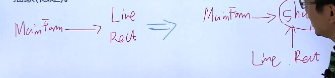

# 一、设计原则

## 1、依赖倒置原则（DIP）

- 高层模块（相对稳定的）不应该依赖于低层模块（相对变化的），二者都应该依赖抽象（相对稳定的）；
- 抽象（相对稳定的）不应该依赖于实现细节（相对变化的），实现细节应该依赖于抽象（相对稳定的）。

高低层均依赖抽象（shape），**实现变化隔离**：

## 2、开放封闭原则（OCP）

- 对扩展开放，对更改封闭；
- 类模块应该是可扩展的，但是不可修改。

## 3、单一职责原则（SRP）

- 一个类应该仅有一个引起它变化的原因；
- 变化的方向隐含着类的责任。
- 注意理解类的责任。

## 4、Liskov替换原则（LSP）

- 子类必须能够替换他们的基类（IS-A）（子类必须有父类的方法）；
- 继承表达类型抽象。
- 里氏替换原则通俗的来讲就是：**子类可以扩展父类的功能，但不能改变父类原有的功能。**它包含以下4层含义：
  - 子类可以实现父类的抽象方法，但不能覆盖父类的非抽象方法。
  - 子类中可以增加自己特有的方法。
  - 当子类的方法重载父类的方法时，方法的前置条件（即方法的形参）要比父类方法的输入参数更宽松。
  - 当子类的方法实现父类的抽象方法时，方法的后置条件（即方法的返回值）要比父类更严格。

## 5、接口隔离原则(ISP)

- 不应该强迫客户程序依赖它们不用的方法；
- 接口应该小而完备。
- 具体体现为类似于集合类中的AbstractList这样的抽象类。

## 6、优先使用对象组合，而不是类继承

- 类继承通常为“白箱复用”，对象组合通常为“黑箱复用”；
- 继承在某种程度上破坏了封装性，子类父类耦合度高；
- 而对象组合则只要求被组合的对象具有良好定义的接口，耦合度低。

## 7、封装变化点

- 使用封装来创建对象之间的分界层，让设计者可以在分界层的一侧进行修改，而不会对另一侧产生不良的影响，从而实现层次间的松耦合。

## 8、针对接口编程，而不是针对实现编程

- 不将变量类型声明为某个特定的具体类，而是声明为某个接口；
- 客户程序无需获知对象的具体属性，只需要知道对象所具有的的接口；
- 减少系统中各部分的依赖关系，从而实现“高内聚、松耦合”的类型设计方案。

# 二、将设计原则提升为设计经验

1. 设计习语 design idioms：描述与特定编程语言相关的底层模式，技巧惯用法。
2. 设计模式 design patterns：主要描述的是“类与相互通信的对象之间的组织关系，包括他们的角色、职责、协作方式等方面。”
3. 架构模式 architectural patterns：描述系统中与基本结构组织关系密切的高层模式，包括子系统划分，职责，以及如何组织它们之间关系的规则。