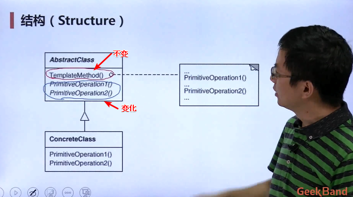
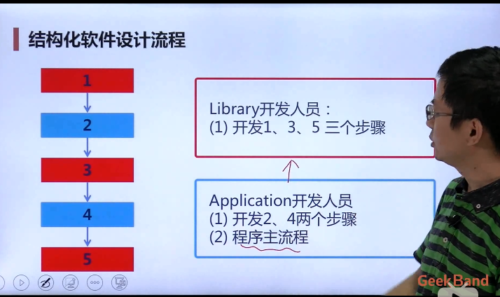
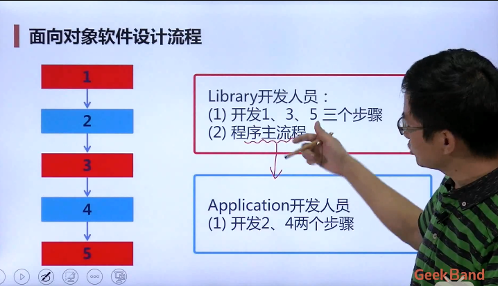
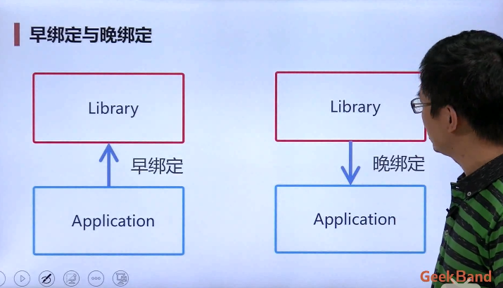

## 定义

- 定义一个操作中的**算法的骨架（稳定）**，而将一些步骤延迟（变化）到子类中。template method使得子类可以不改变（复用）一个算法的结构即可重定义（重写）该算法的某些特定步骤。
- 实质：将一些稳定的部分抽取出来形成一个模板，实现代码和逻辑的复用。
- 应用的**前提**：一个操作中的算法的骨架是稳定的。

## 产生原因

- 在软件构建过程中，对于某一项任务，它常常有**稳定的整体结构**，但各个**子步骤却有很多改变的需求**，或者由于固有的原因（比如框架与应用之间的关系）而无法和任务的整体结构同时实现。
- 如何在确定稳定操作结构的前提下，来灵活应对各个子步骤的变化或者晚期实现需求？

## 结构

## 例子

### 结构化软件设计流程

- 库开发人员开发了几个步骤；
- 应用程序开发人员开发了剩余的步骤和程序的主流程；
- 当运行时，应用程序开发人员写的代码将去调用库开发人员的代码。

### 面向对象软件设计流程

### 区别

- 结构化软件设计流程中应用程序开发人员的负担较重。

## 缺点

- 几乎所有的框架都应用了模板模式，虽然这带来了一些方便，但是同时应用程序开发人员无法查看到程序的整个流程，只见树木而不见森林。

## 要点总结

- 它用最简洁的机制（多态）为很多应用程序框架提供了灵活的扩展点，是代码复用方面基本的实现结构；
- 除了可以灵活应对子步骤的变化外，“不要调用我，让我来调用你”的反向控制结构是template method的典型应用；
- 在具体实现方面，被template method调用的方法可以是有具体实现，也可以没有具体实现，但一般推荐把它们设置为protected方法。