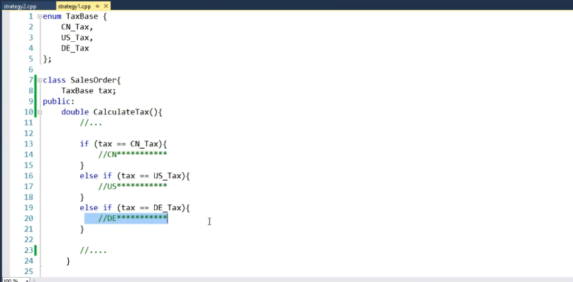
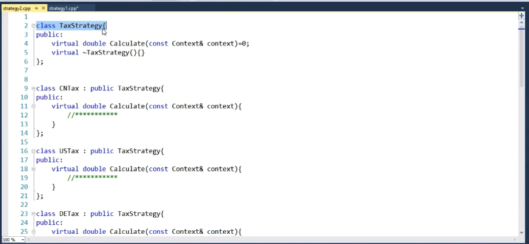
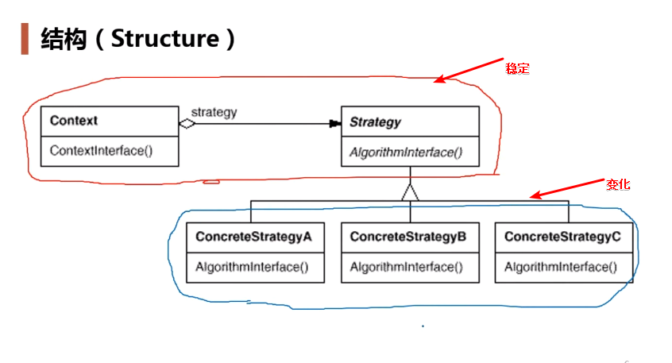

## 动机

- 在软件构建过程中，某些对象使用的算法可能多种多样，经常改变，如果将这些算法都编码到对象中，将会使对象变得异常复杂；而且有时候支持不使用的算法也是一个性能负担；
- 如何在运行时根据需要去选择合适的算法？将算法与对象本身解耦，从而避免上述的问题。

## 例子

计算在各国缴税的问题：

1、采用if-else去判断国家的方式

若是要增加一个国家，则要更改该类的源代码，违反了开闭原则。

2、使用策略模式，设计一个税计算的接口，其他国家的税计算类去实现该类。

## 定义

- 定义一系列算法，把它们一个个封装起来，并且是它们可互相替换（变化）。该模式使得算法可独立域使用它的客户程序（稳定）而变化（扩展，子类化）。

## 结构

## 要点总结

- Strategy及其子类为组件提供了一些列可重用的算法，从而可以使得类型在运行时方便地根据需要在各个算法之间切换；
- strategy模式提供了用条件判断语句以外的另一种选择，消除条件判断语句，就是在解耦合。含有许多条件判断语句的代码通常都需要strategy模式；（如果条件判断永远不变，那么就可以使用条件判断语句，例如根据星期几选择不同的操作。）
- 如果strategy对象没有实例变量，那么各个上下文可以共享同一个strategy对象（单例），从而节省对象开销。
- 客户端必须知道所有的策略类，并自行决定使用哪一个策略类；
- 策略模式将造成产生很多策略类。