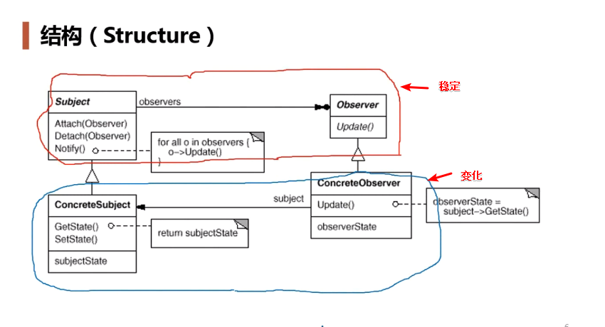

## 动机

- 在软件构建过程中，我们需要为某些对象建立一种“通知依赖关系”——一个对象（目标对象）的状态发生改变，所有的依赖对象（观察者）都将得到通知。如果这样的依赖关系过于紧密，将使软件不能很好地抵御变化。
- 使用面向对象技术，可以将这种依赖关系弱化，并形成一种稳定的依赖关系。从而实现软件体系结构的松耦合。

## 结构

在观察者模式中有如下角色：

- Subject：抽象主体（抽象被观察者），抽象主体角色把所有观察者对象保存在一个集合里，每个主题都可以有任意数量的观察者，抽象主题提供一个接口，可以增加和删除观察者对象（这两种操作可以放在子类中）。
- ConcreteSubject：具体主体（具体被观察者），该角色将有关状态存入具体观察者对象，在具体主题的内部状态发生改变时，给所有注册过的观察者发送通知。
- Observer：抽象观察者，是观察者者的抽象类，它定义了一个更新接口，使得在得到主题更改通知时更新自己。
- ConcreteObserver：具体观察者，实现抽象观察者定义的更新接口，以便在得到主题更改通知时更新自身的状态。

## 要点总结

- 使用面向对象的抽象，observer模式使得我们**可以独立地改变**目标与观察者，从而使得二者之间的依赖关系达到松耦合；
- 目标发送通知时，无需指定观察者，通知会自动传播；
- 观察者自己决定是否需要订阅，目标对象对此一无所知；
- observer模式是基于事件的UI框架中非常常用的设计模式，如消息队列、事件总线的处理机制。
- **缺点**：在java中消息的通知一般是顺序执行的，那么一个观察者阻塞，会影响整体的执行效率，在这种情况下，一般采用异步实现。