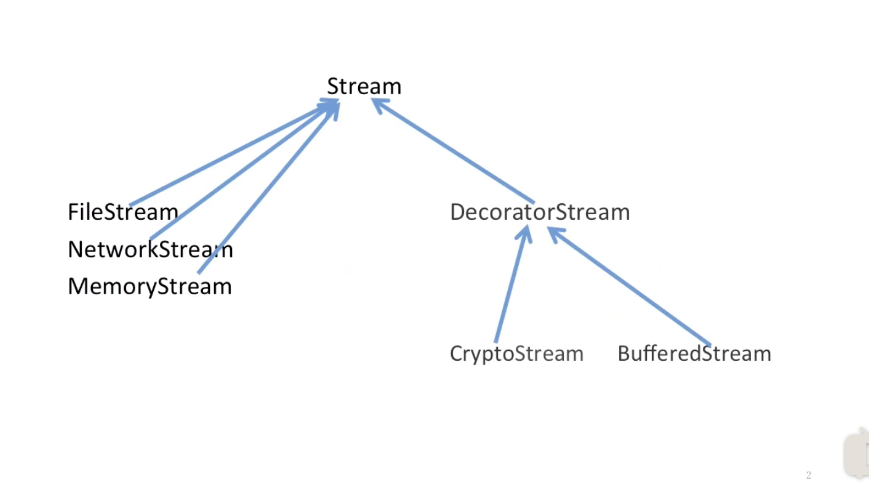

## 动机

- 在某些情况下我们可能会“过度地使用继承来扩展对象的功能”，由于继承为类型引入的静态特质，使得这种扩展方式缺乏灵活性；并且随着子类的增多（扩展功能的增多），各种子类的组合（扩展功能的组合）会导致更多子类的膨胀。
- 如何使“对象功能的扩展”能够根据需要来动态地实现？同时避免“扩展功能地增多”带来的子类膨胀问题？从而使得任何“功能扩展变化”所导致的影响降为最低。

## 例子：

输入流相关：

使用继承：

使用装饰器模式（组合）后：

整体结构和类的数目明显降低。

## 定义

- 动态（组合）地给一个对象增加一些额外的职责。就增加功能而言，decorator模式比生成子类（继承）更为灵活（消除重复代码和减少子类个数）。

## 结构

## 要点总结

- 通过使用组合而非继承的手段，decorator模式实现了在运行时动态扩展对象功能的能力，而且可以根据需要扩展多个功能。避免了使用继承带来的“灵活性差”和“多子类衍生问题”。

- decorator类在接口上表现为is-a component的继承关系，即decorator类继承了component类所具有的接口。但在实现上又表现为has-a component的组合关系，即decorator类又使用了另外一个component类。

- decorator模式的目的并非解决“多子类衍生的多继承问题”，decorator模式应用的要点在于解决“**主体类在多个方向上的扩展功能”**——是为“装饰”的含义。

- 1，不改变原类文件。

- 2，不使用继承。

- 3，动态扩展。

