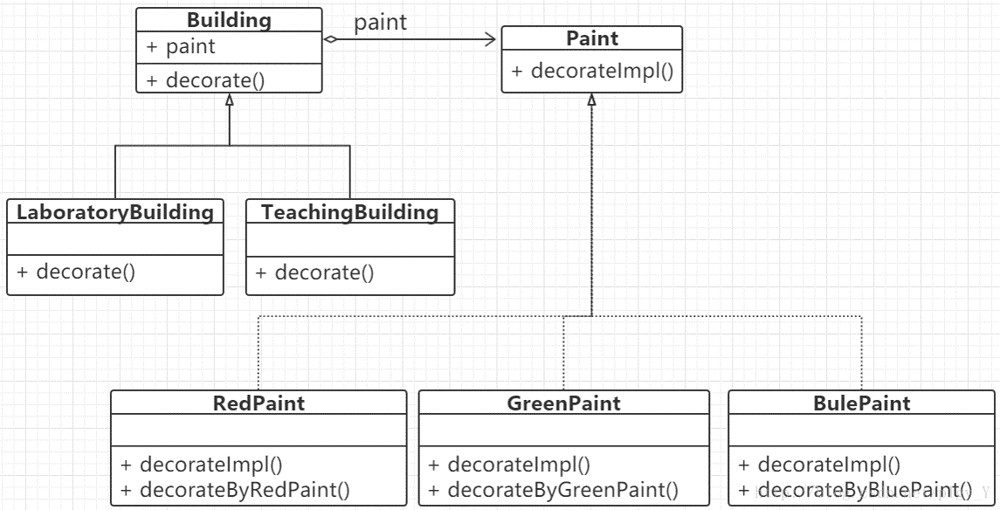

## 动机

- 由于某些类型的固有的实现逻辑，使得它们具有两个变化的维度，乃至多个维度的变化；
- 如何应对这种“多维度的变化”？如何利用面向对象技术来使得类型可以轻松地沿着两个乃至多个方向变化，而不引入额外的复杂度。

## 定义

- 将抽象部分（业务功能）与实现部分（平台实现）分离，使它们都可以独立地变化。

## 结构

## 要点总结

- bridge模式使用“对象间的组合关系”解耦了抽象与实现之间固有的绑定关系，使得抽象和实现可以沿着各自的维度来变化。所谓抽象和实现沿着各自的维度变化，即“子类化”它们；
- bridge模式有时候类似于多继承方案，但是多继承方案往往违背单一职责原则（即一个类只有一个变化的原因）。复用性比较差。bridge模式是比多继承方案更好的解决方法。
- bridge模式的应用一般在“两个非常强的变化维度”，有时一个类也有多于两个的变化维度，这时可以使用bridge的扩展模式。

## 与装饰器模式的区别

- 桥接模式对象自身有 沿着多个维度变化的趋势 ，本身不稳定；
- 装饰者模式对象自身非常稳定，只是为了增加新功能/增强原功能。
- 注意：桥接模式是建筑自己去painting，而装饰器模式为了进一步去装饰，而是paint去painting建筑，即组合的策略发生了变化；
- 桥接模式存在两个接口，接口之间存在组合关系；装饰器模式只有一个父接口，另一个子接口继承自父接口并在其内部持有一个父接口的对象。