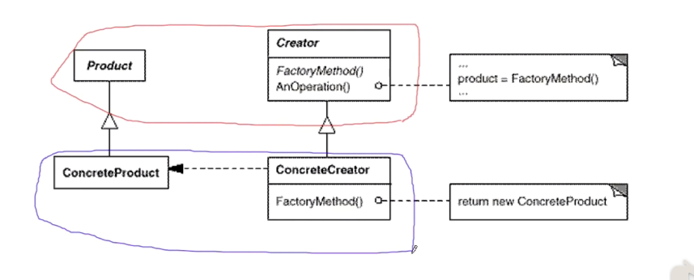

## 动机

- 在软件系统中，经常面临着创建对象的工作；由于需求的变化，需要创建的对象的具体类型经常变化。
- 如何应对这种变化？如何绕过常规的对象创建方法（new），提供一种“封装机制”来避免客户程序和这种“具体对象创建工作”的紧耦合。

## 定义

- 定义一个用于创建对象的接口，让子类决定实例化哪一个类。
- factory method使得一个类的实例化延迟（目的：解耦，手段：接口）到子类。
- **而不是彻底消除了依赖。**

## 结构

## 要点总结

- factory method模式用于隔离类对象的使用者和具体类型之间的耦合关系。面对一个经常变化的具体类型，紧耦合关系（new）会导致软件的脆弱。
- factory method模式通过面向对象的手法（多态），将所要创建的对象工作延迟到子类（**子类为具体的场景，越具体的场景建立的对象和逻辑稳定性越强**），从而实现一种扩展（而非更改）的策略，较好地解决了这种紧耦合关系；
- factory method模式解决”单个对象“的需求变化。缺点在于要求创建方法/参数相同。

## 一些其他分析

- 与一个对象相关的职责通常有三类：**对象本身所具有的职责、创建对象的职责和使用对象的职责**。
- 在所有的工厂模式中，我们都强调一点：**两个类A和B之间的关系应该仅仅是A创建B或是A使用B，而不能两种关系都有**。将对象的创建和使用分离，也使得系统更加符合“单一职责原则”，有利于对功能的复用和系统的维护。
-  此外，将对象的创建和使用分离还有一个好处：防止用来实例化一个类的数据和代码在多个类中到处都是，可以将有关创建的知识搬移到一个工厂类中，这在Joshua Kerievsky的《重构与模式》一书中有专门的一节来进行介绍。因为**有时候我们创建一个对象不只是简单调用其构造函数，还需要设置一些参数，可能还需要配置环境**，如果将这些代码散落在每一个创建对象的客户类中，势必会出现代码重复、创建蔓延的问题，而这些客户类其实无须承担对象的创建工作，它们只需使用已创建好的对象就可以了。此时，可以引入工厂类来封装对象的创建逻辑和客户代码的实例化/配置选项。（为什么借用工厂而不是直接创建类然后传入的原因）
-  使用工厂类还有一个“不是特别明显的”优点，一个类可能拥有多个构造函数，而在Java、C#等语言中构造函数名字都与类名相同，我们**可以提供一系列名字完全不同的工厂方法，每一个工厂方法对应一个构造函数**，客户端可以以一种更加可读、易懂的方式来创建对象，而且，从一组工厂方法中选择一个意义明确的工厂方法，比从一组名称相同参数不同的构造函数中选择一个构造函数要方便很多。
