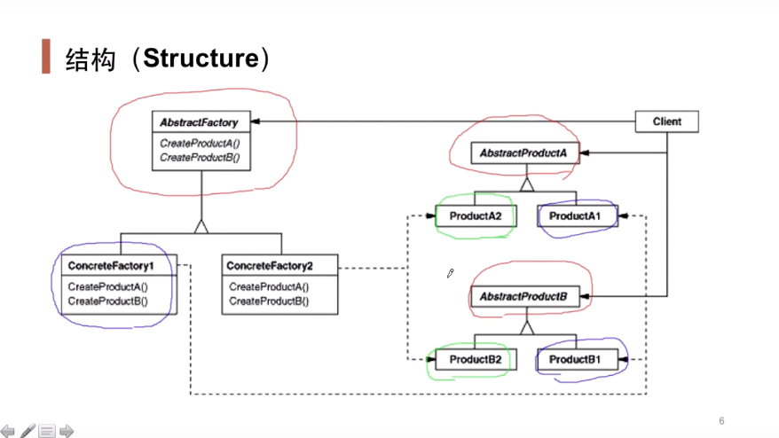

## 动机

- 在软件系统中，经常面临着**“一系列相互依赖的对象”**的创建工作；同时，由于需求的变化，往往存在着更多系列对象的创建工作。
- 如何来应对这种变化？如何绕过常规的对象创建方法（new），提供一种“封装机制”来避免客户程序和这种“多系列具体对象创建工作”的紧耦合。

## 定义

- 提供一个接口，让该接口负责创建“**一系列**相关或者相互依赖的对象”，无需指定他们具体的类。

## 结构

## 要点

- 如果没有应对“多系列对象创建”的需求变化，则没有必要使用abstract factory模式，这时候使用简单的工厂完全可以。
- “系列对象”指的是在某一特定系列下的对象之间有**相互依赖、或作用**的关系。不同系列的对象之间不能相互依赖。
- abstract factory模式主要在于应对“新系列”的需求变动。其**缺点**在于难以应对“新对象”的需求变动。

