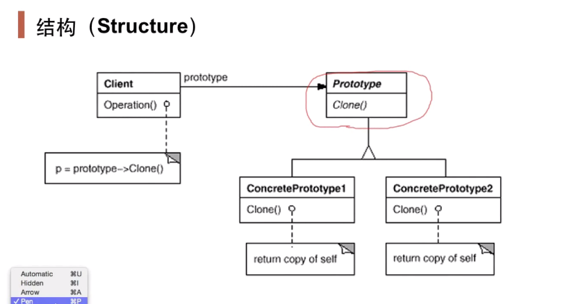

## 动机

- 在软件系统中，经常面临着**“某些结构复杂的对象”的创建工作**；由于需求的变化，这些对象经常面临着剧烈的变化，但是他们却拥有比较稳定一致的接口。
- 如何应对这种变化？如何向“客户程序（使用这些对象的程序）”隔离出“这些易变对象”，从而使得“依赖这些易变对象的客户程序”不随着需求改变而改变？

## 定义

- 使用原型实例指定创建对象的种类，然后通过**深克隆**这些原型来创建新的对象。
- 适用场景：当创建一个对象流程比较复杂，不能用有限的几步去完成，同时有一些**中间状态**（与抽象工厂的区别）需要保留，则使用原型模式。
- 例：创建一个包含多个属性的对象，在大多数情况下，不同对象之间只有很少的属性不同，则可以使用原型模式。

## 结构



## 要点总结

- prototype模式同样用于隔离类对象的使用者和具体类型（易变类）之间的耦合关系，它同样要求这些“易变类”**拥有“稳定的接口”**；
- prototype模式对于“如何创建易变类的实体对象”采用“原型克隆”的方式来做，它使得我们可以非常灵活地动态创建“拥有某些稳定接口”的新对象——所需工作仅仅是注册一个新类的对象（即原型）。然后再任何需要的地方clone；可以使用深克隆的方式保存对象的状态。
- prototype模式中的clone方法可以利用某些框架中的序列化来实现深拷贝。
- 在Java中必须实现Cloneable接口。
- 需要为每个类配备一个克隆方法，而且这个克隆方法设计到整个类，这对全新的类来说不是很难，但对已有的类进行改造时，不是一件容易的事，必须修改其源码，违背了开闭原则；
- 在实现深克隆时需要编写较为复杂的代码。

## 与工厂模式的细微区别

- 工厂模式在创建具体对象（图中红框部分）与client之间继续添加了一个工厂接口，而原型模式则是直接与client相关联。

## 重写clone()方法的原则和步骤

一般而言， Java语言中的clone()方法满足以下几个特征：

- 对任何对象x， 都有x.clone() != x， 即克隆对象与原型对象不是同一个对象；

- 对任何对象x， 都有x.clone().getClass() == x.getClass()， 即克隆对象与原型对象的类型一样；

- 如果对象x的equals()方法定义恰当， 那么x.clone().equals(x)应该成立。

为了获取对象的一份拷贝， 我们可以直接利用Object类的clone()方法， 具体步骤如下：

- 在派生类中覆盖基类的clone()方法， 并声明为public；

- 在派生类的clone()方法中， 调用super.clone()；

- 派生类需实现Cloneable接口。

## Java中实现深克隆的方法

### 通过序列化方式实现深克隆

​		在Java语言中， 如果需要实现深克隆， 可以通过**序列化**(Serialization)等方式来实现。 序列化就是将对象写到流的过程， 写到流中的对象是原有对象的一个拷贝， 而原对象仍然存在于内存中。 通过序列化实现的拷贝不仅可以复制对象本身， 而且可以复制其引用的成员对象， 因此通过序列化将对象写到一个流中， 再从流里将其读出来， 可以实现深克隆。 需要注意的是能够实现序列化的对象其类必须实现Serializable接口， 否则无法实现序列化操作。

```java
try{
//写入字节流
	ByteArrayOutputStream baos=new ByteArrayOutputStream();
	ObjectOutputStream oos=new ObjectOutputStream(baos);
	oos.writeObject(obj);
	oos.close();
 
	//分配内存,写入原始对象,生成新对象
	ByteArrayInputStream bais=new ByteArrayInputStream(baos.toByteArray());//获取上面的输出字节流
	ObjectInputStream ois=new ObjectInputStream(bais);
 
	//返回生成的新对象
	cloneObj=(T)ois.readObject();
	ois.close();
}catch (Exception e){
	e.printStackTrace();
}

```

### 重写clone()方法实现深克隆

```java
class Animal implements Cloneable{
        Person host;//主人
        int age;//年纪
        Animal(Person person,int age){
                this.host=person;
                this.age=age;
        }
        @Override
        public Object clone(){
                try{
                        Animal animal=(Animal) super.clone();
                        animal.host=(Person)host.clone();//深拷贝处理
                        return animal;
                }catch (CloneNotSupportedException e){
                        return null;
                }
        }
}
```


