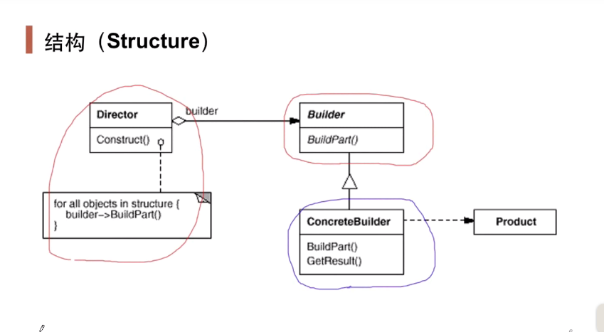

## 动机

- 在软件系统中，有时候面临着“一个复杂对象”的创建工作，其通常由各个部分的子对象用一定的算法构成；由于需求的变化，这个复杂对象的各个部分经常面临着剧烈的变化，但是将他们组合在一起的算法却相对稳定。
- 其核心思想是将一个“复杂对象的构建算法”与它的“部件及组装方式”分离，使得构建算法和组装方式可以独立应对变化；复用同样的构建算法可以创建不同的表示，不同的构建过程可以复用相同的部件组装方式。
- 如何应对这种变化？如何提供一种“封装机制”来隔离出“复杂对象的各个部分”的变化，从而保持系统中的“稳定构建算法”不醉这需求改变而改变？

## 定义

- 将一个复杂对象的构建与其表示相分离，使得同样的构建过程（稳定）可以创建不同的表示（变化）。

## 结构

## 要点总结

- builder模式主要用于“分步骤构建一个复杂的对象”。在这其中“分步骤”是一个稳定的算法，而复杂对象的各个部分则经常变化。
- 变化点在哪里，封装哪里——builder模式主要在于应对“复杂对象各个部分”的频繁需求变动。其缺点在于难以应对“分步骤构建算法”的**（算法）需求**变动（可以考虑策略模式）。
- 在builder模式中，要注意不同语言中构造器内调用虚函数的差别。

## 与模板方法的区别

- 模板方法侧重方法，而构建器侧重对象的创建。