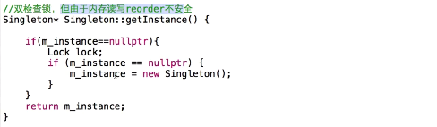
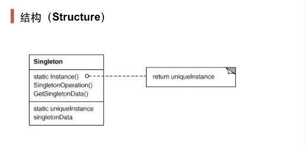

## 动机

- 在软件系统中，经常有这样一些特殊的类，必须保证他们在系统中只存在一个实例，才能保证他们的逻辑正确性、以及良好的效率。
- 如何绕过常规的构造器，提供一种机制来保证一个类只有一个实例？
- 这应该是类设计者的责任，而不是使用者的责任。

## 双重检验版本及其缺点



- 只要外层判断存在的问题：如果两个线程同时进入到Lock，则单例被破坏；
- 只要内层判断存在的问题：每次进入都要创建锁、销毁锁，代价过高，所以先判断一次是否为空，如果为空则直接返回，性能较好；
- 但存在内存读写reorder（指令重排，编译器优化）不安全。（正常的执行顺序是：分配内存，调用构造器，最后赋值给变量；若是先赋值给构造器然后再调用构造器，如果此时有一个线程进入该段代码，判断实例不为空，直接返回实例，但是此时构造器尚未调用，返回出现错误。）
- Java解决方案：将成员变量设置为volatile，让编译器对该单例的赋值不进行编译优化。

## 定义

- 保证一个类仅有一个实例，并提供一个该实例的全局访问点。

## 结构



## 要点

- singleton模式中的实例构造器可以设置为protected以允许子类派生；
- singleton模式一般不要支持clone接口，同时注意其序列化问题（解决办法就是在反序列化的过程中使用readResolve()方法），因为这可能导致多个对象实例，与singleton模式的初衷相背；
- 如何实现多线程环境下安全的singleton？注意对双检查锁的正确实现。

## 常见实现方式

### 1、饿汉式单例（线程安全）

饿汉式单例是指在方法调用前，实例就已经创建好了。


``` java
public class MySingleton {
	
	private static MySingleton instance = new MySingleton();
	
	private MySingleton(){}
	
	public static MySingleton getInstance() {
		return instance;
	}
	
}
```

测试方法：

```java

public class MyThread extends Thread{
  	
	@Override
	public void run() { 
		System.out.println(MySingleton.getInstance().hashCode());
	}
	
	public static void main(String[] args) { 
		
		MyThread[] mts = new MyThread[10];
		for(int i = 0 ; i < mts.length ; i++){
			mts[i] = new MyThread();
		}
		
		for (int j = 0; j < mts.length; j++) {
			mts[j].start();
		}
	}
}
```

### 2、懒汉式单例（非线程安全）

懒汉式单例是指在方法调用获取实例时才创建实例，因为相对饿汉式显得“不急迫”，所以被叫做“懒汉模式”。


```java
public class MySingleton {
	
	private static MySingleton instance = null;
	
	private MySingleton(){}
	
	public static MySingleton getInstance() {
		if(instance == null){//懒汉式
			instance = new MySingleton();
		}
		return instance;
	}
}
```

### 3、线程安全的懒汉式单例

- 使用synchronized实现同步方法；
- 使用synchronized实现同步代码块；

### 4、双重校验锁

```java
public class MySingleton {
	
	//使用volatile关键字保其可见性
	volatile private static MySingleton instance = null;
	
	private MySingleton(){}
	 
	public static MySingleton getInstance() {
		try {  
			if(instance == null){
				//创建实例之前可能会有一些准备性的耗时工作 
				synchronized (MySingleton.class) {
					if(instance == null){//二次检查
						instance = new MySingleton();
					}
				}
			} 
		} catch (InterruptedException e) { 
			e.printStackTrace();
		}
		return instance;
	}
}
```

### 5、静态内部类实现线程安全的单例

```java

public class SingleTon{
    
  private SingleTon(){}
 
  private static class SingleTonHoler{
     private static SingleTon INSTANCE = new SingleTon();
 }
 
  public static SingleTon getInstance(){
    return SingleTonHoler.INSTANCE;
  }
}

```

分析：

- 静态内部类的优点是：**外部类加载时并不需要立即加载内部类**，内部类不被加载则不去初始化INSTANCE，故而**不占内存**。即当SingleTon第一次被加载时，并不需要去加载SingleTonHoler，只有当getInstance()方法第一次被调用时，才会去初始化INSTANCE,第一次调用getInstance()方法会导致虚拟机加载SingleTonHoler类，**这种方法不仅能确保线程安全，也能保证单例的唯一性，同时也延迟了单例的实例化。**
- 虚拟机会保证一个类的<clinit>()方法在多线程环境中被正确地加锁、同步，如果多个线程同时去初始化一个类，那么只会有一个线程去执行这个类的<clinit>()方法，其他线程都需要阻塞等待，直到活动线程执行<clinit>()方法完毕。
- **缺点**：由于是静态内部类的形式去创建单例的，故外部无法传递参数进去，例如Context这种参数，所以，我们创建单例时，可以在静态内部类与DCL模式里自己斟酌。

### 6、使用枚举数据类型实现单例模式

枚举enum和静态代码块的特性相似，在使用枚举时，构造方法会被自动调用，利用这一特性也可以实现单例。枚举类型是目前最安全的单例模式，可以防范序列化与反序列化，也可以防范反射攻击。

```java
public enum EnumFactory{ 
    
    singletonFactory;
    
    private MySingleton instance;
    
    private EnumFactory(){//枚举类的构造方法在类加载是被实例化
        instance = new MySingleton();
    }
        
    public MySingleton getInstance(){
        return instance;
    }
    
}
 
class MySingleton{//需要获实现单例的类，比如数据库连接Connection
    public MySingleton(){} 
}
```


### 7、序列化与反序列化

```java
public class MySingleton implements Serializable{
	
	private static MySingleton instance = new MySingleton();
	
	private MySingleton(){}
	
	public static MySingleton getInstance() {
		return instance;
	}
	
	//该方法在反序列化时会被调用，该方法不是接口定义的方法，有点儿约定俗成的感觉
	protected Object readResolve() throws ObjectStreamException {
		System.out.println("调用了readResolve方法！");
		return MySingleton.instance; 
	}
}
```


除了枚举类型之外所有的单例模式都存在序列化与反序列化问题，原因是：

序列化会通过反射调用无参数的构造方法创建一个新的对象。