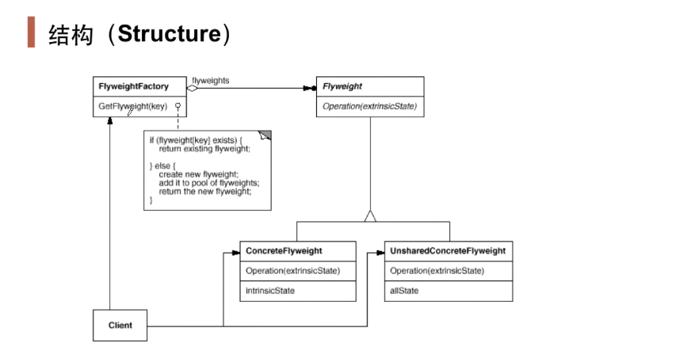

## 动机

- 在软件系统采用纯粹对象方案的问题在于大量**细粒度的对象**（如字符串、数字）会很快充斥在系统中，从而带来很高的运行时代价——主要指内存需求方面的代价。
- 如何避免在大量细粒度对象问题的同时，让外部客户程序仍然能够透明地使用面向对象的方式来进行操作？

## 定义

- 运用共享技术有效地支持大量细粒度的对象。

## 结构

- 对象池的概念——线程池，常量池，连接池等
- 在享元模式中引入了享元工厂类，享元工厂类的作用在于提供一个用于存储享元对象的**享元池**，当用户需要对象时，首先从享元池中获取，如果享元池中不存在，则创建一个新的享元对象返回给用户，并在享元池中保存该新增对象。
- 享元类的设计是享元模式的要点之一，在享元类中要将内部状态和外部状态分开处理，通常将内部状态作为享元类的成员变量，而外部状态通过注入的方式添加到享元类中。

## 要点总结

- 面向对象很好地解决了抽象性的问题，但是作为一个运行在机器中的程序实体，我们需要考虑对象的代价问题。flyweight主要解决面向对象的代价问题，一般不触及面向对象的抽象性问题。
- flyweight采用对象共享的做法来降低系统中对象的个数，从而降低细粒度对象给系统带来的内存压力。在具体实现方面，要注意对象状态的处理。
- 对象的数量太大从而导致对象内存开销加大——什么样的数量才算大？这需要我们仔细地根据具体应用情况进行评估，而不能凭空臆断。