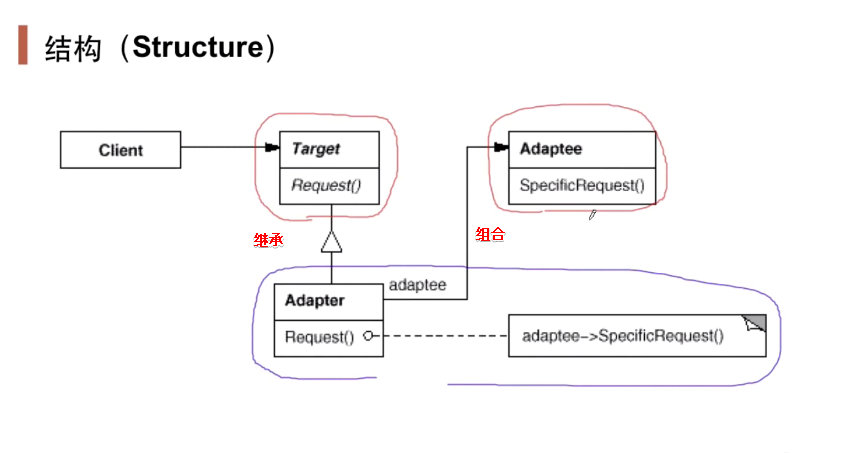

## 动机

- 在软件系统中，由于应用环境的变化，常常需要将“一些现存的对象”放在新的环境中应用，但是新环境要求的接口是这些现存对象所不满足的。
- 如何应对这种“迁移的变化”？如何既能利用现有对象的良好表现，同时又能满足新的应用环境所要求的接口？

## 定义

- 将一个类的接口转换成客户希望的另一个接口。adapter模式使得原本由于接口不兼容而不能一起工作的那些类可以一起工作。

## 结构

- 使用继承以适应新的需求，使用组合以利用原有接口。（队列、栈）

## 要点

- adapter模式主要应用于“希望复用一些现存的类，但是接口又与复用对象环境要求不一致的情况“，在遗留代码复用、类库迁移等方面非常有用。
- GoF 23 定义了两种adapter模式的实现结构：**对象适配器**和**类适配器**。但类适配器采用“多继承”的实现方式，一般不推荐使用。对象适配器采用“对象组合”的方式，更符合耦合精神。
- adapter模式可以实现得非常灵活，不必拘泥于GoF 23 中定义的两种接口。例如，完全可以将adapter模式中的“现存对象“作为新的接口方法参数，来达到适配的目的。