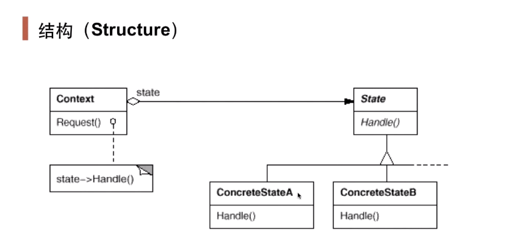

## 动机

- 在软件构建过程中，某些对象的状态如果变化，其行为也会随之而发生变化，比如文档处于只读状态，其支持的行为和读写状态支持的行为就可能完全不同。
- 如何在运行时根据状态的对象来透明地更改对象的行为？而不会对对象操作和状态转化之间引入紧耦合?
- 可变因素：
  - 状态可能增减；
  - 对同一状态的操作可能变化。

## 定义

- 允许一个对象在其内部状态改变时改变它的行为。从而使对象看起来似乎修改了其行为。

## 结构

- 与策略模式有些相似，但是策略模式是策略的整体结构不变，而其中的步骤发生改变，较为微观；状态模式是策略整体发生变化，较为宏观。

## 要点

- state模式将所有与一个特定状态相关的行为都放入到一个state的子类对象中，在对象状态切换时，切换相应的对象；但同时维持state的接口，这样实现了具体操作与状态转换之间的解耦。
- 为不同状态引入不同的对象使得状态转换变得更加明确，而且可以保证不会出现状态不一致的情况，因为转换时原子性的——即要么彻底转换过来，要么不转换。
- 如果state对象没有实例变量，那么各个上下文可以共享一个state对象（单例模式），从而节省对象开销。