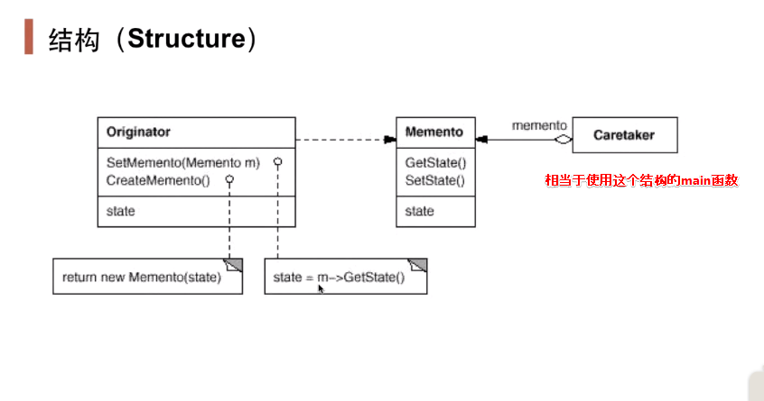

## 动机

- 在软件构建过程中，某些对象的状态在转换过程中，可能由于某种需要要求程序能够回溯到对象之前处于某个点时的状态。如果使用一些公共接口来让其他对象得到对象的状态，便会暴露对象的细节实现。
- 如何实现对象状态的良好保存于恢复？但同时又不会因此而破坏对象本身的封装性。

## 定义

- 在不破坏封装性的前提下，捕获一个对象的内部状态，并在该对象之外保存这个状态。这样以后就可以将该对象恢复到原先保存的状态。
- 在该对象内部创建一个memento对象，该memento对象保存该对象的状态，若要恢复该对象的状态，就将memento状态放入该对象，然后调用恢复操作，但是这个操作是被封装的。

## 结构

- **发起人：**记录当前时刻的内部状态，负责定义哪些属于备份范围的状态，负责创建和恢复备忘录数据。
- **备忘录：**负责存储发起人对象的内部状态，在需要的时候提供发起人需要的内部状态。
- **管理角色：**对备忘录进行管理，保存和提供备忘录。

## 要点

- 备忘录（memento）存储原发器（originator）对象的内部状态，在需要时恢复原发器状态。
- memento模式的核心是信息隐藏，即originator需要向外界隐藏信息，保持其封装性。但同时又需要将状态保持到外界（memento）。
- 由于现代语言运行时都具有相当的对象**序列化**支持，因此往往采用效率较高、又较容易正确实现的序列化方案来实现memento模式。
- 优点：
  - 当发起人角色中的状态改变时，有可能这是个错误的改变，我们使用备忘录模式就可以把这个错误的改变还原。
  - 备份的状态是保存在发起人角色之外的，这样，发起人角色就不需要对各个备份的状态进行管理。
- 缺点：
  - 在实际应用中，备忘录模式都是多状态和多备份的，发起人角色的状态需要存储到备忘录对象中，对资源的消耗是比较严重的。