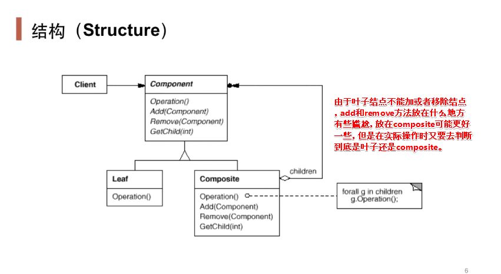

## 动机

- 软件在某些情况下，客户代码过多地依赖于对象容器复杂的内部实现结构，对象容器内部实现结构（而非抽象接口）的变化将引起客户代码的频繁变化，带来了代码的维护性、扩展性等弊端。
- 如何将“客户代码与**复杂的对象容器结构**”解耦？让对象容器自己来实现自身的复杂结构，从而使得客户代码就像处理简单对象一样来处理复杂的对象容器？

## 定义

- 将对象组合成**树形结构**以表示“整体-部分”的层次结构。composite使得用户对单个对象和组合对象的使用具有一致性（稳定）。

## 结构

- 如果考虑变化，叶子结点是不是一直会是叶子结点，是不是使用状态模式去动态地决定状态更加合适。

## 要点

- composite模式采用树形结构来实现普遍存在的对象容器，从而将“一对多”的关系转化为“一对一”的关系，使得客户代码可以一致地（复用）处理对象和对象容器，无需关心处理的是单个的对象，还是组合的对象容器。
- 将“客户代码与复杂的对象容器结构”解耦是composite的核心思想，解耦之后，客户代码将与纯粹的抽象接口——而非对象容器的内部实现结构——发生依赖，从而更能“应对变化”。
- composite模式在具体实现中，可让父对象中的子对象反向追溯；如果父对象有频繁的遍历需求，可使用缓存技巧来改善效率。