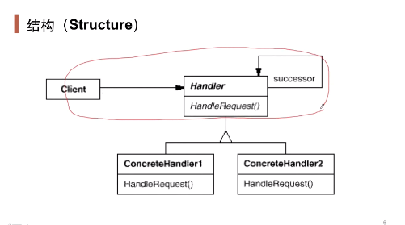

## 动机

- 在软件构建过程中，一个请求可能被多个对象处理，但是每个请求在运行时只能有一个接受者，如果显示指定，将必不可少地带来请求发送者与接受者的紧耦合。
- 如何使请求的发送者不需要指定具体的接受者？让请求的接受者自己在运行时决定来处理请求，从而使两者解耦。

## 定义

- 使多个对象都有机会处理请求，从而避免请求的发送者和接收者之间的耦合关系。**将这些请求连成一条链**，并沿着这条链传递请求，直到有一个对象处理它为止。

## 结构

- 需要设计判断是否能处理的数据结构。

## 要点

- chain of responsibility模式的应用场合在于“一个请求可能有多个接受者，但是最后真正的接受者只有一个”，这时候请求发送者与接受者的耦合有可能出现“变化脆弱”的症状，职责链的目的就是将二者解耦，从而更好地应对变化。
- 应用了chain of responsibility的时候，对象的职责分派将更具有灵活性。我们可以在运行时动态添加或者修改请求的处理职责。
- 如果请求传递到职责链的末尾仍得不到处理，应该有一个合理的缺省机制。这也是每一个接受对象的责任，而不是发出请求的对象的责任。
- 如果责任链过长，可能导致得到响应的时间变长。