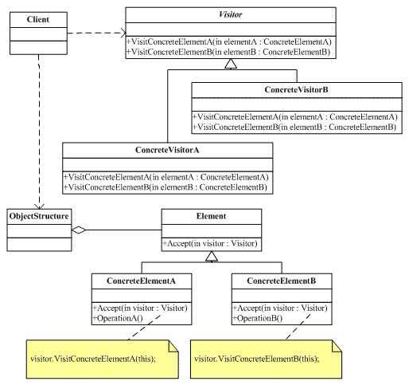

## 动机

- 在软件构建过程中，由于需求的改变，某些**类层次结构中**常常需要增加新的行为（方法），如果直接在基类中做这样的更改，将会给子类带来很**繁重的变更负担**，甚至破坏原有设计。
- 如何在不更改类层次结构的前提下，在运行时根据需要透明地为类层次结构上的各个类动态添加新的操作，从而避免上述问题？

## 定义

- 表示一个作用于某对象结构中的各元素的操作。使得可以在不改变（稳定）各元素的类的前提下定义（扩展）作用于这些元素的新操作（变化）。

## 结构

.assets/66baf8e8ffd4ee1db267ba488f76c20b_445x595.gif)

- 意图：主要将数据结构与数据操作分离。
- 主要解决：稳定的数据结构和易变的操作耦合问题。
- “访问器”（`Visitor`）模式使我们能扩展基本类型的接口，方法是创建类型为`Visitor`的一个独立的类结构，对以后需对基本类型采取的操作进行虚拟。基本类型的任务就是简单地“接收”访问器，然后调用访问器的动态绑定方法。
- 缺点：visitor要求Element的所有子类确定，不然visitor需要修改，又违背了开闭原则。

## 要点

- Visitor模式通过所谓的双重分发（double dispatch）来实现现在不更改（不添加新的操作——编译时）Element类层次结构的前提下，在运行时透明地为类层次结构上的各个类动态添加新的操作（支持变化）。
- 所谓双重分发即Visitor模式中间包括了两个多态分发（注意其中的多态机制）：第一个为accept方法的多态辨析；第二个为visitElementX方法的多态辨析。
- Visitor模式的最大缺点在于扩展类层次结构（增添新的Element子类），会导致Visitor类的改变。因此Visitor模式**适用**于“Element类层次结构稳定，而其中的操作却经常面临频繁改动”。